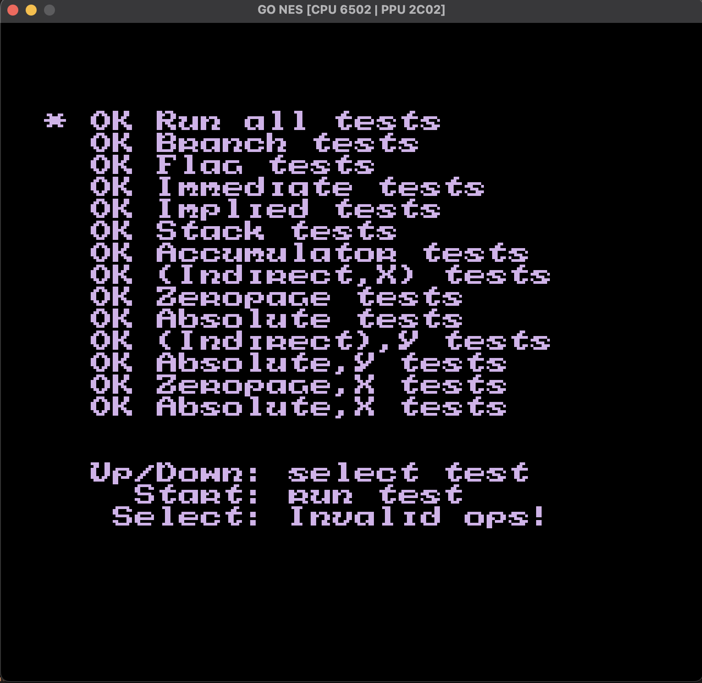

# Little, incomplete but (kind of) cycle accurate NES-Emulator written in Go.
Uses SDL2 for graphics and input. Does not support sound.
Has support for Mapper 0, 1 and 2 (Legend of Zelda, Mario Bros., Donkey Kong etc.)

Passes all the CPU tests of the NesTest ROM. (https://www.nesdev.org/wiki/Emulator_tests)
Graphics are working fine as far as i can tell, no artifacts apart from the ones the NES has by default.

Resources:
- https://www.nesdev.org/
- https://www.youtube.com/@javidx9
- https://www.masswerk.at/6502/6502_instruction_set.html

---

CPU -      MOS Technology 6502: https://en.wikipedia.org/wiki/MOS_Technology_6502

PPU(GPU) - Ricoh 2C02: https://www.nesdev.org/2C02%20technical%20reference.TXT

---

